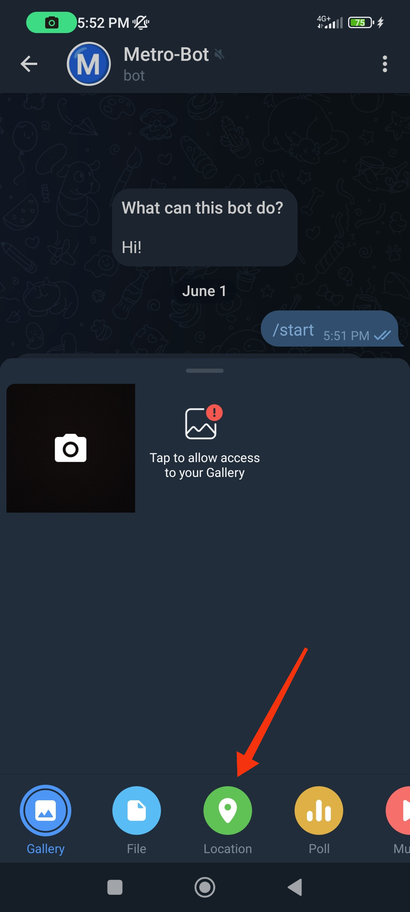

# Metro-Bot

Metro-Bot is a Telegram Bot that consists of a series of modules (`restaurants.py, metro.py, city.py, bot.py, random_test.py`) that, combined with data extracted of the official TMB (Transports Metropolitans de Barcelona) website and OSM (Open Street Map) aswell as data from Barcelona's restaurants (all referenced below), offers several services. It allows you to browse for restaurants, and, once you have chosen one, the bot offers you a guidance command that will show you the fastest possible way to get to the restaurant of your choice by foot and using Barcelona's Metro Service. The bot can also show you information about the restaurants you look for, and will provide a detailed image of the path you should take once you want to start your journey. Other features will be discused throughout the document.

## Getting Started

Once  `Metro-Bot.zip` is downloaded and unzipped, you will find the earlier mentioned modules and other files such as the data files(`restaurants.csv, estacions.csv, accessos.csv, barcelona.grf`), the requirements file (`requirements.txt`) among others. With all these files, Metro-Bot is almost ready to run. Once you have checked the `Prerequisites` you just need to execute the `bot.py` module (`python3 bot.py` in Linux) and open Telegram to add Metro-Bot to your conversations, now, you should be able to start using the bot with the command `/start`. Try to use `/help` to see all the other available commands. Further explanations on how to use Metro-Bot can be checked in `Get Metro-Bot Running`.

### Prerequisites

Before using Metro-Bot, check `requirements.txt` and make sure to install the following libaries in the machine you want to use:

-`fuzzysearch`==0.7.3  
-`haversine`==2.5.1  
-`matplotlib`==3.5.2  
-`networkx`==2.8  
-`osmnx`==1.1.2  
-`pandas`==1.4.2  

All of them can be installed or updated with the command `pip3 install 'library_example'` (in Linux).

For example, to install `fuzzysearch` you would use the following command:

`pip3 install fuzzysearch`

### Get Metro-Bot Running

This section offers a step by step guide to get Metro-Bot running (in a Linux enviornment):

#### Executing bot.py:

Once the Prerequisites have been acomplished and you are in the directory containing all modules and data, run the following command:

`python3 boot.py`

If this is the first time you run the bot, it may take some time to generate the `CityGraph` that contains all information realted to the streets and metro lines.

#### Adding Metro-Bot:

To add Metro-Bot to your Telegram contacts, type in Telegram's browsing bar the following @:

`@metronyan_bot`

This should start a chat with Metro-Bot.

#### Using Metro-Bot:

Now that you have the chat with Metro-Bot, use the following command:

`/start`

If Metro-Bot has been executed properly, it will answer you with introduction meassage and you will be able to start trying some other commands. Remember to share your location with Metro-Bot right after using the `/start` command, otherwise the bot won't be able to guide you properly. To share your location you can follow this easy steps:

<figcaption>Step 1:</figcaption>

<figcaption>Step 2:</figcaption>

<figcaption>Step 3:</figcaption>

<figcaption>Step 4:</figcaption>


Once you use the `/find` command and then the `/guide 'number of the desired restaurant'`, you should get a result like this:


Remember to use the command `/help` to get to know all the available commands and their uses.

## Running tests

To test the code you have several options, you can run tests directly with Metro-Bot in Telegram to see its functioning or you can code some main functions in the different modules to test the modules and their functions individually. For example, there are some functions in the modules that can help you see if the graphs used have been generated properly, these are:

In `metro.py` module:

```python
def show(g: MetroGraph) -> None:
```
Which will open a new window showing an interactive representation of the Metro graph.

```python
def plot(g: MetroGraph, filename: str) -> None:
```
Which will generate and save an image of the Barcelonas's map with the graphic representation of the Metro graph on it.

Or the variants of these funcions for the `city.py` module:

```python
def show(g: CityGraph) -> None:
```
Which will open a new window showing an interactive representation of the City graph.

```python
def plot(g: CityGraph, filename: str) -> None:
```
Which will generate and save an image of Barcelona's map with the graphic representation of the City graph on it.

The content of these test-related functions can be slightly changed to obtain representations of your preference (color and size of nodes and edges, size and 'quality' of the images generated, ...). You can also check the `random_tests.py` file that contains some pre-coded main functions to check some of the modules functionalities individually.

### Coding style tests

The code follows the `pycodestyle` format. It can be easilly installed (in Linux) using `pip3 install pycodestyle`. To check if the additions you may make to the modules follow properly this style you just have to run the following command:

`pycodestyle module.py`

For example, if you want to test `restaurants.py` module and you have coded a main fucntion to do it, use the following command to make sure the added code follows the proposed style:

`pycodestyle restaurants.py`

This, will show the 'errors' of your code in terms of style and you will be able to correct them.

## Built With

* [Python](https://www.python.org/) - Coding language used
* [Telegram](https://web.telegram.org/k/) - Used for bot usage
* [Networkx](https://networkx.org/) - Used for graph generation and route selection
* [OSM / osmnx](https://www.openstreetmap.org/) - Maps used for graph generation, image renderization and route selection
* [Barcelona's Metro Stations](https://raw.githubusercontent.com/jordi-petit/ap2-metro-nyam-2022/main/data/blob/main/estacions.csv) - Used for graph generation and rute selection
* [Barcelona's Metro Accesses](https://raw.githubusercontent.com/jordi-petit/ap2-metro-nyam-2022/main/data/blob/main/accessos.csv) - Used for graph generation and rute selection
* [Barcelona's Restaurants](https://raw.githubusercontent.com/jordi-petit/ap2-metro-nyam-2022/main/data/restaurants.csv) - Used for restaurant browsing and route selection.

## Authors

* **Juan Pablo Zaldivar** - *First grade student of GCED in UPC (Universitat Politècnica de Catalunya)* - 2022

* **Enric Millán Iglesias** - *First grade student of GCED in UPC (Universitat Politècnica de Catalunya)* - 2022

## Acknowledgments

* Hat tip to Jordi Petit, Emma Rollón and Jordi Cortadella for proposing this project and helping us out with doubts and problems.
